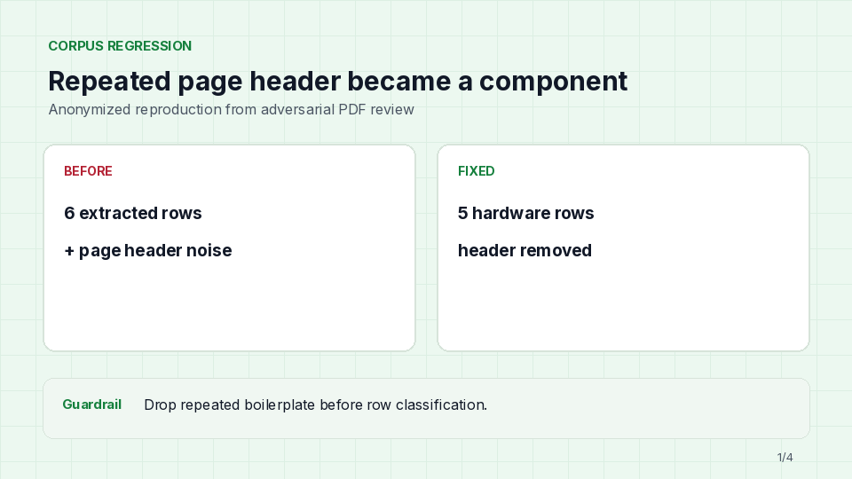
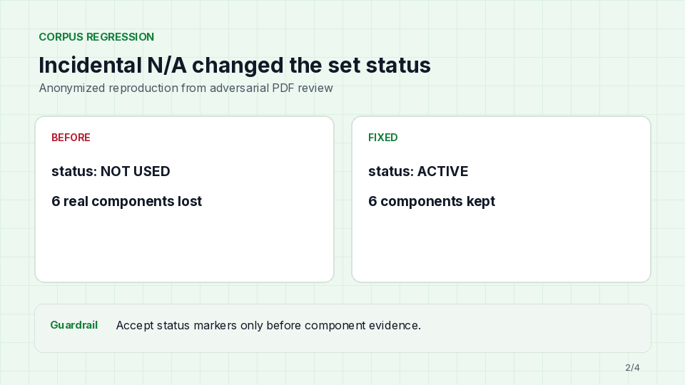
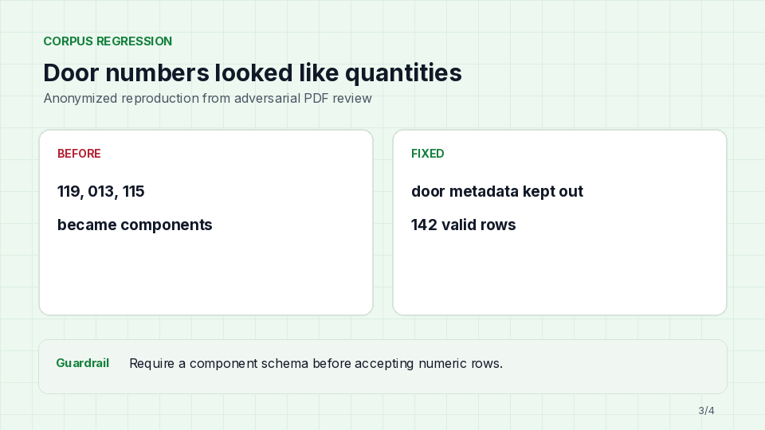
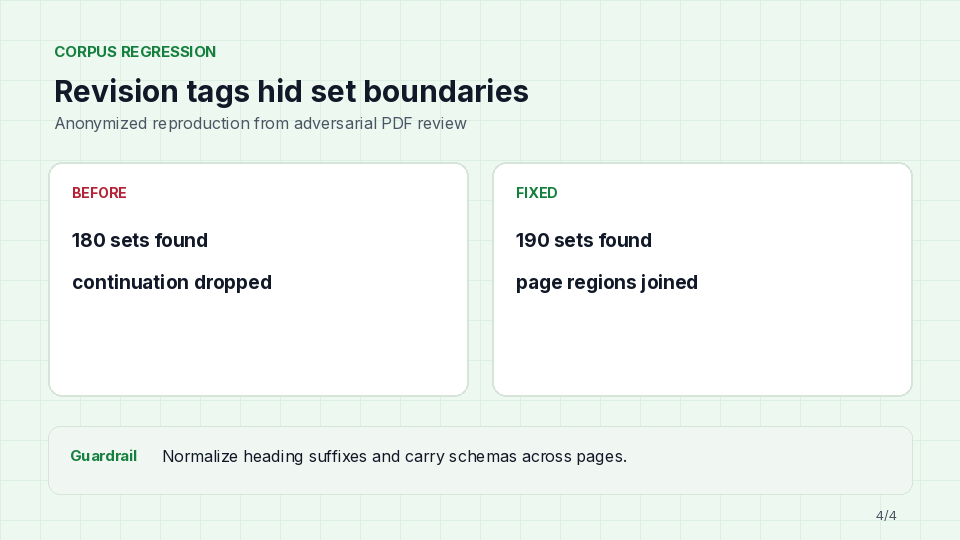

# Fresco Hardware Sets

## Summary

Fresco Hardware Sets extracts door hardware schedules from Division 08 PDFs, keeps the source
location for every set, and returns validated JSON for review or downstream use.

The repository includes an offline text-PDF parser, an optional OpenAI vision backend, local and
hosted review applications, and a labeled corpus evaluation.

## Description

The extractor handles list schedules, tables, reordered columns, multi-page sets, `NOT USED` sets,
missing quantities, and same-page shorthand legends. It uses table-level context for ambiguous codes
such as `PE` and `NO`. Source strikeouts are preserved as exact field ranges, including partial
catalog edits, and removal notes stay attached to the affected component. The extractor also
separates a confirmed empty result from an unreadable or incomplete source instead of forcing a
low-confidence guess.

There are three supported outcomes:

- `extracted`: one or more hardware sets were found.
- `no_hardware_sets`: the inspected pages were readable and contained no relevant sets.
- `needs_review`: the source was truncated, externally referenced, image-only for the offline parser,
  or otherwise too unreliable to extract safely.

## Project Demo

Upload, extract, and compare the structured result with the source PDF.


Multi-page sets retain one normalized source region per page.


Review normalized component fields, keep missing quantities uninferred, and use the full-table CSV
export action.


## Live Demo

The deployed result viewer is available at
[cfireborn.github.io/fresco](https://cfireborn.github.io/fresco/).

The site is public and does not require an account. Upload a text-based PDF and the browser scans it
for likely hardware schedule pages before extraction. Review components and page regions, then
download JSON or export the complete component schedule as CSV for estimating and ordering.
Provenance cards render enlarged pages from the attached PDF with the extracted regions highlighted.
A manual page override remains under the advanced controls. PDF bytes and extracted text are not
uploaded or stored. Existing extraction JSON can also be imported for review. Source edits render
with strike formatting and are labeled as order exclusions or partial edits in the full table and CSV.

The browser path deliberately returns `needs_review` for scans, missing set boundaries, truncated
schedules, and other sources it cannot support safely. The Python CLI and Streamlit application
remain the higher-coverage paths for corpus-tested extraction and optional vision processing.

## Project Assignment

[Original Notion brief](https://jet-jonquil-d17.notion.site/Fresco-Coding-Challenge-Hardware-Sets-313e090653228072b1e2d6ab4b437c0d)

Build a system that extracts every hardware set from Division 08 specification pages. Each set must
include:

- `set_number`
- optional `description`
- page and bounding box or line-range location
- components with `qty`, `description`, `catalog_number`, `mfr`, `finish`, and `notes`

An exchange with Akhil (CTO) clarified:

- The output should support a self-standing platform that can show users the extraction result.
- Text-based PDFs are the accuracy priority. OCR is useful when time permits.
- The system must say when no relevant hardware sets are present.

Design decision of my own:
- The implementation should make an explicit choice when a source is too incomplete to trust.

This project uses `needs_review` for the last case.


### Materials

The evaluation corpus was
provided separately and curated into 43 PDFs across 21 projects. No source specbook was downloaded
from the public web. One explicitly selected Roselle fixture is bundled for the public demo. The
other source PDFs, their original filenames, and private client or project details are not committed.

## Technologies Used

- Python 3.11+
- Node.js 22.13+ for the hosted browser workflow
- PyMuPDF and Pydantic
- PDF.js for browser-local text extraction
- OpenAI Responses API as an optional vision backend
- Streamlit for extraction review and correction
- React, PDF.js, vinext, and Cloudflare Workers for the hosted extractor
- pytest and Ruff
- Git LFS for GIF and video assets

## Setup Instructions

```bash
python -m venv .venv
source .venv/bin/activate
pip install -e ".[all]"
```


### Run the CLI

```bash
# Offline text-PDF parser
hardware-sets extract spec.pdf \
  --pages 42-48 \
  --backend heuristic \
  --output output.json
```


## Development Progress

### Phase 1: Data contract, CLI, and first review loop

Added strict Pydantic models, explicit page selection, compact PDF creation, JSON validation, CLI
commands, and the initial Streamlit review flow.

### Phase 2: Layout and provenance

Added global row assembly, detected table schemas, normalized bounding boxes, line ranges, repeated
set occurrence handling, and multi-page source overlays.

### Phase 3: Corpus caveats

Implemented exact status handling, contextual `PE` and `NO` classification, missing-quantity rules,
same-page lookup resolution, wrapped rows, set-column boundaries, revision-suffixed headings, and
continuation across adjacent pages.

### Phase 4: Adversarial review and regression fixes

The regression pass caught page headers emitted as hardware, incidental `N/A` changing a set status,
door numbers emitted as quantities, dropped continuation pages, and missed revision-tagged headings.
These anonymous reproductions show each failure and its parser guardrail.

**Repeated page headers:** recurring boilerplate is removed before component-row classification.



**Set status:** an incidental `N/A` does not mark a set unused after component evidence begins.



**Quantity parsing:** door-number metadata is rejected until a component table schema is established.



**Multi-page boundaries:** revision suffixes are normalized so headings stay detectable and
continuation regions remain joined.



### Phase 5: Product polish and deployment

Added explicit empty and review-required outcomes, concise schema feedback, anonymous demo assets,
the labeled corpus evaluator, and the public browser-local PDF workflow.

### Phase 6: Revision markup and continuation hardening

Preserved full and partial source strikeouts in JSON, the review UI, and CSV export. The corpus pass
also caught a three-row continuation page that lacked a repeated header, a numeric catalog mistaken
for a finish, and cabinetry prose mistaken for a hardware set. Anonymous regressions cover each case.

### Earlier versions

Before the Fresco visual refresh, the README used dark Streamlit captures and matching regression
cards. They remain as development artifacts: 


.

## Time Spent

I did not keep a minute-by-minute timer. Best focused-time estimate:

- First implementation pass: about 2 hours
- Parser edge cases and tests: about 3 hours
- Corpus labeling and adversarial review: about 2 hours
- UI, demos, documentation, and deployment: about 3 hours
- Revision markup, continuation fixes, and final browser verification: about 2 hours

**Total: approximately 12 hours**, excluding unattended extraction, build, and deployment time.


## Design Choices

### Manufacturer and finish codes

The parser detects table headers and evaluates the population of each code column. A column dominated
by `MK`, `LCN`, and `SCH` is treated as manufacturer data. A column dominated by `US26D`, `630`, and
`BSP` is treated as finish data. Ambiguous values such as `PE` are assigned only after the column role
is known. So `PE = Pemko` is not attached to a finish
and `PE = Painted Enamel` is not attached to a manufacturer.

### NOT USED and N/A

An exact status marker before component evidence produces a retained set with `status: "not_used"`
and an empty component list.

### Multi-page sets

A set continues only onto an adjacent selected page with structural evidence such as a repeated set
heading, a carried table schema, or valid component rows. Each page receives its own source region.

### Inconsistent layouts and missing values

Column roles come from each detected header rather than a fixed position. Reordered and combined
columns are supported. Missing quantities stay `null`.

### Same-page shorthand resolution

The parser collects component, option, finish, and manufacturer legends from the full page before
extracting sets. This supports lookup tables both before and after the schedule.

### Source revisions and strikeouts

Flattened midline marks and PDF StrikeOut annotations are mapped to zero-based, end-exclusive ranges
on the extracted fields. A whole struck component is retained for auditability and labeled `EXCLUDE`;
a partial strike is labeled `REVIEW EDIT`. Notes such as a closer-removal instruction are attached to
the matching component instead of being parsed as another row.

## Scoping and Tradeoffs

- The hosted browser 
  discovers schedule pages with a sequential text scan and offers an optional manual override.
- The heuristic backend is cheap, deterministic, and strong on text PDFs, but it does not OCR scans.
- The OpenAI backend accepts image-based PDFs and irregular layouts, but needs an API key and should
  be evaluated separately before publishing an accuracy claim.
- The hosted Site runs a conservative TypeScript text-PDF extractor. It never transmits source PDFs
- A strike that crosses part of a rendered glyph is represented at word granularity because PDF text
  extraction does not expose sub-glyph source characters reliably.
- Heuristic confidence values are deterministic review-priority signals, not calibrated
  probabilities of correctness.

## Agent Documentation

[AGENTS.md](AGENTS.md) defines repository boundaries, extraction invariants, verification commands,
and documentation rules. [CLAUDE.md](CLAUDE.md) points other coding agents to the same instructions.
